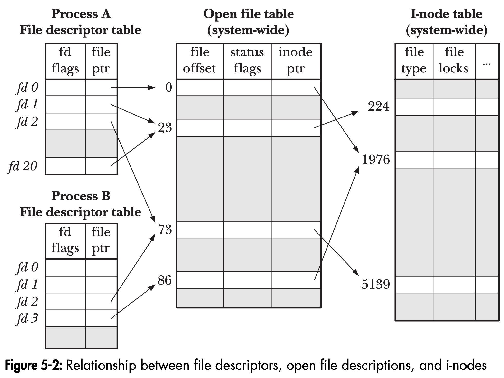

# File Descriptor

## 前言

這篇文章會說明 file descriptor 和 opened file 的關係（對應到`The Linux Programming Interface`的5.4章節）。

## user space 和 kernel space 的架構 

每一個 process 會有一個 File descriptor table 用 fd 來索引 file descriptor entry。
實際從下圖看可以了解到 file descriptor entry 儲存的是指向由 kernel 維護的 Open file table entry 的指標。
Open file table entry 本身表示一次 open 產生的 open file description，內部的成員能夠再進一步指到代表檔案本體的 inode。 



## 從程式碼實作理解

### A. File descriptor table -> Open file table

process 會從 `struct task_struct` 找到 `*files` 這個成員，指向這個 process 的 `files_struct`。
```c
struct task_struct {
    ...
    struct files_struct *files;
    ...
}
```

`struct fdtable __rcu *fdt` 指向一個 fd table，其中的 `struct file __rcu **fd` 這個成員正是建立了上圖 File descriptor table 的映射，將 fd number 映射到一個 `struct file*` 類型的指標。 
```c
struct files_struct {
  /*
   * read mostly part
   */
        atomic_t count;
        bool resize_in_progress;
        wait_queue_head_t resize_wait;

        struct fdtable __rcu *fdt;
        struct fdtable fdtab;
  /*
   * written part on a separate cache line in SMP
   */
        spinlock_t file_lock ____cacheline_aligned_in_smp;
        unsigned int next_fd;
        unsigned long close_on_exec_init[1];
        unsigned long open_fds_init[1];
        unsigned long full_fds_bits_init[1];
        struct file __rcu * fd_array[NR_OPEN_DEFAULT];
};
```

```c
struct fdtable {
    ...
    struct file __rcu **fd;
    ...
}
```

### B. Open file table -> Inode table
從 `struct file` 的成員可以看到 Open file table 中對應的欄位
* file offset：f_pos
* status flags: f_flags
* inode pointer: f_inode
```c
struct file {
    ...
    fmode_t                         f_mode;
    const struct file_operations    *f_op;
    struct address_space            *f_mapping;
    struct inode                    *f_inode;
    unsigned int                    f_flags;
    union {
            const struct path       f_path;
            struct path             __f_path;
    };
    loff_t                          f_pos;
    ...
}
```

從 `struct file` 的 f_inode 成員就可以從 I-node table 找到對應的檔案本體，`struct inode` 可以看成是檔案的 metadata。
```c
struct inode {
    ...
    umode_t   i_mode; // 檔案類型和權限
    kuid_t    i_uid;  // owner
    kgid_t    i_gid;  // group
    loff_t    i_size; // 檔案大小
    ...
}
```


