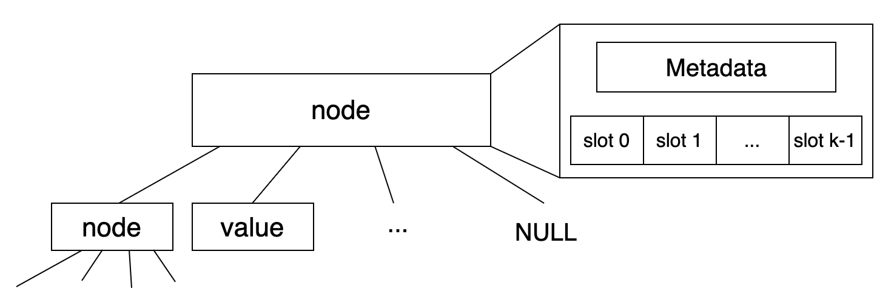

# Linux 核心的 xarray 實作

## 前言 

`struct xarray` 作為 `struct address_space` 的成員，被用在 page cache 的場景中。
一個 process 存取檔案的基本單位是 page。檔案的資料也會透過 cache 來加速，因此 linux 核心要知道目標的 page 是否有在 page cache 中，以及對應到哪一個 page cache 的 folio。
這個映射關係正是透過下方的 `i_pages` 來完成。
```c
struct address_space {
    ...
    struct xarray i_pages;
    ...
}
```

## 為什麼要使用 xarray？

- 目標是要建立 page index 到 folio 的映射關係
- 需要具備稀疏陣列的能力，因為存取檔案的 offset 可能相隔很遠，例如分別讀 `offset=0` 和 `offset=100GB` 的 page 
- 至於為什麼不採用 hash map，有看到來自 [linux kernel docs, core API, "XArray"](https://www.kernel.org/doc/html/v6.4/core-api/xarray.html) 的解釋。
一個例子是在讀取檔案的時候，linux 核心有 readahead 的行為，會把目標 page 之後的幾個 page 也預先從硬碟讀到 page cache。在這個情況下就會需要資料結構能夠快速地移動到下一個 page index。

 > Unlike a hash, it allows you to sensibly go to the next or previous entry in a cache-efficient manner.
 
 > The XArray implementation is efficient when the indices used are densely clustered; hashing the object and using the hash as the index will not perform well.

## 程式碼實作

### xarray 結構

下圖展示一個 xarray node 的結構，

* xarray entry 有三種可能的內容：
    1. node 包含 metadata 和 slots
        * node 的 metadata 儲存這個 node 的資訊，後面介紹會再看到
        * slots 可以看成是 edge，連向 node 的 k 個 children
    2. value 可以視作 xarray 這種樹狀結構的葉節點，代表輸入的 index 有對應的值
    3. NULL 可以視作 xarray 這種樹狀結構的葉節點，代表輸入的 index 沒有對應的值



### xarray entry

xarray 利用最低 2 個 bits 來判斷 entry 的類型。這是因為一般的 object 指標都是 4-byte alignment，所以正常的指標的最低 2 個 bits 都是 `00`。

1. **Pointer entry：** 指要存進 xarray 的 value
2. **Internal entry：xaaray** 內部使用的 entry，下面還有詳細的介紹
3. **Value entry or tagged pointer：** 透過 `xa_mk_value` 產生的小數值
4. **Sibling entry：** 這個 slot 指向同一個 multi-index entry 的兄弟 slot，multi-index entry 建立了多對一的 key-value 關係
    ```
    slot 4 -> real entry
    slot 5 -> sibling to slot 4
    slot 6 -> sibling to slot 4
    ```
5. **Retry entry：** 讀取過程因為發生並行的寫入修改或不穩定的狀態，因此需要重讀
6. **Zero entry：** 特殊的內部零值 entry，透過 `xa_zero_to_null` 轉成 NULL


```c
/*
 * The bottom two bits of the entry determine how the XArray interprets
 * the contents:
 *
 * 00: Pointer entry
 * 10: Internal entry
 * x1: Value entry or tagged pointer
 *
 * Attempting to store internal entries in the XArray is a bug.
 *
 * Most internal entries are pointers to the next node in the tree.
 * The following internal entries have a special meaning:
 *
 * 0-62: Sibling entries
 * 256: Retry entry
 * 257: Zero entry
 *
 * Errors are also represented as internal entries, but use the negative
 * space (-4094 to -2).  They're never stored in the slots array; only
 * returned by the normal API.
 */
```

前面提到 internal node 有幾種類型，要判斷它們的類型是透過 `>> 2` 來得到 internal value。
```c
static inline void *xa_mk_internal(unsigned long v) {
    return (void *)((v << 2) | 2);
}


static inline unsigned long xa_to_internal(const void *entry) {
        return (unsigned long)entry >> 2;
}

static inline bool xa_is_internal(const void *entry) {
        return ((unsigned long)entry & 3) == 2;
}
```

### xarray state

`xarray state`，可以理解成是 xarray 的 cursor，會記錄操作的中間變數以及資料變化。
* `xa_index` 指的是這次操作的目標 index，例如要找 index 為 `0x8E` 的 entry
* `xa_offset` 表示在目前操作走到的 node 中選到的 slot 編號
* `xa_node` 表示在目前操作走到的 node

除此以外，還要考慮 xarray 的 multi-index，也就是有 `slibling entry` 的情況。

* `xa_shift` 定義了在找某個 index 對應的 slot 要停在哪一層 bit。（可以看下面 `xas_set_order` 的例子會更具體）
* `xa_sibs` 指的是除了目前的 offset，還需要額外覆蓋多少 slibing slot，範圍是 `[slot, slot + xa_sibs]`

```c
struct xa_state {
    struct xarray *xa;
    unsigned long xa_index;
    unsigned char xa_shift;
    unsigned char xa_sibs;
    unsigned char xa_offset;
    unsigned char xa_pad;           /* Helps gcc generate better code */
    struct xa_node *xa_node;
    struct xa_node *xa_alloc;
    xa_update_node_t xa_update;
    struct list_lru *xa_lru;
};
```

`order` 定義一個 entry 要覆蓋的連續 index 數量，總共是 $2^{order}$ 個。
這裡以 `index = 0x5CD3`， `order = 8` 為例子說明 `xas_set_order`。
討論的目的是要找到這個 index 對應的 slot，以此對 `xas_shift` 和 `xas_sibs` 有更深刻的認識。

- 假設 `XA_CHUNK_SHIFT = 8`，那麼 `xas->xa_index = 0x5C`，`xas->xa_shift = 8`，`xas->xa_sibs = 0`。`slot = (0x5C >> 8) & 0xFF = 0x5C`。意思是在計算 slot 的時候停在了 `shift = 8` 這個 level，而在 `0x5C` 這個 slot 便可以覆蓋 `0x5C00 ~ 0x5CFF` 這 `2^8 = 256` 個 index。
- 但是一般在 64-bit 平台上，linux 實作設定 `XA_CHUNK_SHIFT = 6`，因此 `xas->xa_index = 0x5C`，`xas->xa_shift = 6`，`xas->xa_sibs = 3`。`slot = (0x5C >> 6) & 0x3F = 0x30`。意思是在計算 slot 的時候停在了 `shift = 6` 這個 level，這個 slot 覆蓋 `0x5C00 ~ 0x5C3F`，可以發現還需要 3 個 slots 才能完整表達`index = 0x5CD3 對應需要覆蓋的 256 個 index`，所以透過額外 3 個 siblings： `0x31, 0x32, 0x33` 來覆蓋剩餘的 index。

```c
static inline void xas_set_order(struct xa_state *xas, unsigned long index,
                                        unsigned int order)
{
#ifdef CONFIG_XARRAY_MULTI
    xas->xa_index = order < BITS_PER_LONG ? (index >> order) << order : 0;
    xas->xa_shift = order - (order % XA_CHUNK_SHIFT);
    xas->xa_sibs = (1 << (order % XA_CHUNK_SHIFT)) - 1;
    xas->xa_node = XAS_RESTART;
#else
    BUG_ON(order > 0);
    xas_set(xas, index);
#endif
}
```
接著說明 xarray 部分比較重要的操作

### A. Load

xarray 的查找路徑是由兩個數值決定

1. 查看的 bits 數量，例如進入下一層要看 k 個 bits，那麼總共會有 $2^k$ 個 slots。（在 linux 核心中被定義為 `XA_CHUNK_SHIFT`)
2. shift 則表示目前要看哪裡的 k 個 bits

```c
#ifndef XA_CHUNK_SHIFT
#define XA_CHUNK_SHIFT    (IS_ENABLED(CONFIG_BASE_SMALL) ? 4 : 6)
#endif
#define XA_CHUNK_SIZE     (1UL << XA_CHUNK_SHIFT)
#define XA_CHUNK_MASK     (XA_CHUNK_SIZE - 1)
```

```c
struct xa_node {
        unsigned char   shift;          /* Bits remaining in each slot */
        unsigned char   offset;         /* Slot offset in parent */
        unsigned char   count;          /* Total entry count */
        unsigned char   nr_values;      /* Value entry count */
        struct xa_node __rcu *parent;   /* NULL at top of tree */
        struct xarray   *array;         /* The array we belong to */
        union {
                struct list_head private_list;  /* For tree user */
                struct rcu_head rcu_head;       /* Used when freeing node */
        };
        void __rcu      *slots[XA_CHUNK_SIZE];
        union {
                unsigned long   tags[XA_MAX_MARKS][XA_MARK_LONGS];
                unsigned long   marks[XA_MAX_MARKS][XA_MARK_LONGS];
        };
};
```

走訪 slot 的路徑是藉由 `(index >> node->shift) & XA_CHUNK_MASK` 來完成，
以下方的參數為例的 xarray 查找，`(0x8E >> 4) & 0xF = 0x8`，所以會走進 slot 8。
- `XA_CHUNK_SHIFT = 4`
- `index = 0x8E`
- `node->shift = 4`


linux 核心的 xarray 使用 `xa_load` 函式找到 `index` 的 entry。一開始先建立 `xarray state`。entry 會由 `xas_load` 函式走訪 xarray 的 node（稱為 descend）。
可以注意到 `xas_descend` 內部的 `get_offset` 正是透過前文提到的 shift 和 AND mask 的運算來決定要走訪哪一個 slot。
並且 `xas_descend` 會用 `xas->xa_node = node` 和 `xas->xa_offset = offset` 來更新 state，以此紀錄目前走到哪裡。

!!! TODO
    目前還有 retry、rcu操作、判斷是否是 sibling 等概念還沒看過，算是待辦清單

 
```c
void *xa_load(struct xarray *xa, unsigned long index)
{
    XA_STATE(xas, xa, index);
    void *entry;

    rcu_read_lock();
    do {
            entry = xa_zero_to_null(xas_load(&xas));
    } while (xas_retry(&xas, entry));
    rcu_read_unlock();

    return entry;
}

void *xas_load(struct xa_state *xas)
{
    void *entry = xas_start(xas);

    while (xa_is_node(entry)) {
            struct xa_node *node = xa_to_node(entry);

            if (xas->xa_shift > node->shift)
                    break;
            entry = xas_descend(xas, node);
            if (node->shift == 0)
                    break;
    }
    return entry;
}

static __always_inline void *xas_descend(struct xa_state *xas,
                                        struct xa_node *node)
{
    unsigned int offset = get_offset(xas->xa_index, node);
    void *entry = xa_entry(xas->xa, node, offset);

    xas->xa_node = node;
    while (xa_is_sibling(entry)) {
            offset = xa_to_sibling(entry);
            entry = xa_entry(xas->xa, node, offset);
            if (node->shift && xa_is_node(entry))
                    entry = XA_RETRY_ENTRY;
    }

    xas->xa_offset = offset;
    return entry;
}

static unsigned int get_offset(unsigned long index, struct xa_node *node)
{
    return (index >> node->shift) & XA_CHUNK_MASK;
}
```

### B. Store
`xa_store` 把 entry 加入到 xarray，之後就可以用 index 從 xarray load 這個 entry。
`__xa_store` 依然會在一開始建立 xarray state，接著呼叫 `xas_store` 函式。下文會著重討論 `xas_store` 的實作。

```c
void *__xa_store(struct xarray *xa, unsigned long index, void *entry, gfp_t gfp)
{
    XA_STATE(xas, xa, index);
    void *curr;

    if (WARN_ON_ONCE(xa_is_advanced(entry)))
            return XA_ERROR(-EINVAL);
    if (xa_track_free(xa) && !entry)
            entry = XA_ZERO_ENTRY;

    do {
            curr = xas_store(&xas, entry);
            if (xa_track_free(xa))
                    xas_clear_mark(&xas, XA_FREE_MARK);
    } while (__xas_nomem(&xas, gfp));

    return xas_result(&xas, xa_zero_to_null(curr));
}

void *xa_store(struct xarray *xa, unsigned long index, void *entry, gfp_t gfp)
{
    void *curr;

    xa_lock(xa);
    curr = __xa_store(xa, index, entry, gfp);
    xa_unlock(xa);

    return curr;
}
```
`xas_store` 的目的是完成 `xarray[index] = entry`，其中若是 entry 為 NULL，會刪除這個 index 的 entry。
下面的實作先判斷 `entry` 是否為 NULL。
- 若不是 NULL，等於是要在 xarray 新增或更新 entry。修改之前需要確保對應的 node 存在，因此透過 `xas_create` 確保 `xas->xa_index` 在 xarray 有對應的位置，並把 xas 定位到該位置，若是不存在的話，才建立新的 node。
`allow_root` 指的是當 entry 滿足條件的情況下，可以直接存在 `xas->xa->xa_head`。
- 若是 NULL，則用 `xas_load` 找到 `xas->xa_index` 的位置，並在後續刪除對應的 entry。

```c 
if (entry) {
    bool allow_root = !xa_is_node(entry) && !xa_is_zero(entry);
    first = xas_create(xas, allow_root);
} else {
    first = xas_load(xas);
}
```

如果 node 是 NULL 的話，代表這次操作不是針對 `xa_node` 的某個 slot，而是直接對 `xa->xa_head` 這個 root entry 做修改。

```c 
node = xas->xa_node;
offset = xas->xa_offset
...
if (node) {
    slot = &node->slots[offset];
    ...
}
```

如果 entry 是 NULL 的話，那麼先處理 mark，例如在 page cache 的案例中，對於 dirty page 會有 mark，在決定要刪除這個 entry 之前，要先把這個 mark 清掉。
```c
if (!entry)
    xas_init_marks(xas);
```

`rcu_assign_pointer(*slot, entry)` 可以理解成 `*slot = entry`，也就是真正把 entry 寫入 slot 的操作。
接著需要檢查這個 slot 原本存放的舊 entry 是不是指向一個 internal node，如果是的話，由於這次的 store 會讓這個 internal node 變成不可達，所以需要釋放這個 internal node 在 xarray 內的節點。

```c
rcu_assign_pointer(*slot, entry);
if (xa_is_node(next) && (!node || node->shift))
        xas_free_nodes(xas, xa_to_node(next));

count += !next - !entry;
values += !xa_is_value(first) - !value;

update_node(xas, node, count, values);
```

上面是針對沒有 multi-index 的簡化案例做討論，接下來擴展到有 multi-index 的情況。

```c
void *xas_store(struct xa_state *xas, void *entry)
{
    node = xas->xa_node;
    
    // 如果當前走到的 node 比 xas 預計的 xa_shift 還高
    // 那麼就不需要 sibling，因為目前的 node 足以涵蓋 xas 的 multi-index
    if (node && (xas->xa_shift < node->shift))
        xas->xa_sibs = 0;
    
    // first 這次 store 目標位置的舊 entry
    // 如果舊的 entry 和要加入的 entry 一樣，且不是 multi-index
    // 那就什麼都不用做，直接回傳
    if ((first == entry) && !xas->xa_sibs)
        return first;

    next = first;
    // multi-index 的範圍：[offset, max]
    offset = xas->xa_offset;
    max = xas->xa_offset + xas->xa_sibs;
    if (node) {
        slot = &node->slots[offset];
        if (xas->xa_sibs)
            xas_squash_marks(xas);
    }

    for (;;) {
        rcu_assign_pointer(*slot, entry);
        if (xa_is_node(next) && (!node || node->shift))
            xas_free_nodes(xas, xa_to_node(next));
        if (!node)
            break;
        count += !next - !entry;
        values += !xa_is_value(first) - !value;
        if (entry) {
            // 到最後一個 slot 了，結束迴圈
            if (offset == max)
                break;
            // 建立 sibling entry，指向真正 entry 所在的 offset
            if (!xa_is_sibling(entry))
                entry = xa_mk_sibling(xas->xa_offset);
        } else {
            if (offset == XA_CHUNK_MASK)
                break;
        }
        // 移動 offset 到下一個 slot
        // 並且讀取新的 slot 的 entry 存到 next
        next = xa_entry_locked(xas->xa, node, ++offset);
        if (!xa_is_sibling(next)) {
            if (!entry && (offset > max))
                break;
            first = next;
        }
        slot++;
    }
    update_node(xas, node, count, values);
    return first;
}
```

